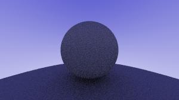

# Simple Tracer V2
This is a remake of one of my older ray tracer projects, only difference is that it is this time written in python instead of C++  

This time however I am planning on actually finishing this and having it fully working :P  

### TODO/Plans:
- Roughness, Metallic, etc. (PBR Piepeline)  
- An editor of some sort that allows you to add shapes to scene, thinking of something similar to hammmer  
- Camera FOV/Perspective transfomration  
- Loading planes from meshes and then rendering them  
- Optimizations
